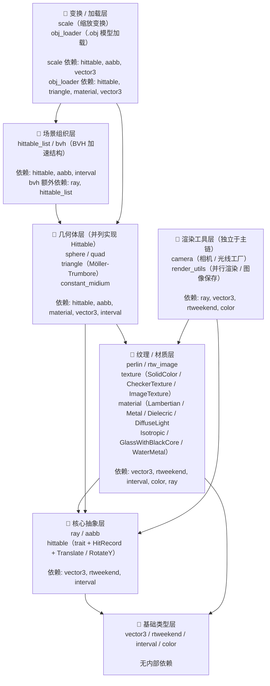
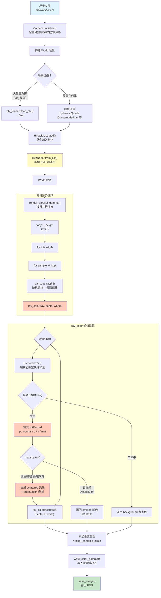

# 🎨 Raytracer

> 基于 Rust 实现的光线追踪渲染器

基于 [*Ray Tracing In One Weekend*](https://raytracing.github.io/) 系列书籍实现，使用 Rust 语言从零构建的物理光线追踪渲染器。

## ✨ 特性

- ✅ **完整实现 Book 1 & Book 2** — 涵盖漫反射、金属、玻璃（电介质）、体积介质、BVH 加速、纹理映射、康奈尔盒子等全部章节
- 🧵 **多线程并行加速** — 基于 [Rayon](https://docs.rs/rayon/) 实现按行并行渲染，充分利用多核 CPU
- ⚡ **静态分发优化** — 泛型材质与变换消除虚表调用开销，提升渲染效率
- 📦 **3D 模型加载** — 支持 `.obj` 模型文件，使用 Möller-Trumbore 算法实现三角形求交
- 🌍 **环境光照** — 基于图像的环境光源（HDR 环境照明）
- 🎨 **高级材质**
  - `GlassWithBlackCore` — 模拟汽车黑色烤漆（清漆层 + 深色底漆）
  - `WaterMetal` — Perlin 噪声驱动的波纹水面材质

## 📁 项目结构

```
.
├── src/
│   ├── main.rs              # 程序入口
│   ├── book1/               # Book 1 章节实现（20 个场景）
│   ├── book2/               # Book 2 章节实现（18 个场景）
│   ├── tools/               # 核心渲染工具模块
│   │   ├── vector3.rs       # 3D 向量
│   │   ├── ray.rs           # 光线
│   │   ├── camera.rs        # 相机
│   │   ├── sphere.rs        # 球体
│   │   ├── quad.rs          # 四边形
│   │   ├── triangle.rs      # 三角形（Möller-Trumbore）
│   │   ├── material.rs      # 材质系统（漫反射/金属/玻璃/车漆/水面等）
│   │   ├── texture.rs       # 纹理（纯色/棋盘格/图像）
│   │   ├── bvh.rs           # BVH 加速结构
│   │   ├── aabb.rs          # 轴对齐包围盒
│   │   ├── perlin.rs        # Perlin 噪声
│   │   ├── obj_loader.rs    # .obj 模型加载器
│   │   ├── hittable.rs      # 可命中物体 trait
│   │   ├── hittable_list.rs # 物体列表
│   │   └── render_utils.rs  # 并行渲染工具函数
│   └── work/                # 最终场景作品
│       ├── final_scene.rs   # 最终场景
│       ├── sportcar.rs      # 跑车
│       ├── earth_night.rs   # 地球夜景
│       ├── glass_tower.rs   # 玻璃塔
│       ├── black_car_paint.rs # 黑色车漆展示
│       ├── gold_stripe.rs   # 金条纹球
│       ├── bridge.rs        # 桥梁场景
│       └── ball.rs          # 球体场景
├── doc/                     # 文档与 Bonus 说明
├── Cargo.toml               # 项目清单
└── rust-toolchain.toml      # Rust 工具链版本
```

## 🧩 模块依赖关系

`src/tools/` 内部模块的分层依赖关系如下。箭头方向表示 `use` 引用关系（A → B 表示 A 引用了 B）。



> **阅读指南**：场景文件（`src/work/*.rs` / `src/book*/*.rs`）通常只直接依赖 `camera`、`color`、`material`、`bvh`、`hittable_list` 以及各几何体模块，无需理解全部底层实现即可创建新场景。

## 🔄 渲染新场景流程

从编写一个场景文件到最终输出图像，完整的渲染管线如下：



> **关键路径**：`Camera 生成光线 → BVH 加速求交 → 材质散射 → 递归追踪 → 累加采样 → 输出图像`

## 🚀 快速开始

### 环境要求

- **Rust** 2024 edition（通过 [rustup](https://rust-lang.org/tools/install) 安装）
- 项目使用 `rust-toolchain.toml` 固定工具链版本

### 编译与运行

```bash
# 克隆项目
git clone https://github.com/jbn-1or/Raytracer.git
cd Raytracer

# 以 Release 模式运行（强烈推荐，以获得最佳性能）
cargo run --release
```

默认运行 `final_scene` 场景。要切换场景，修改 `src/main.rs` 中的调用：

```rust
fn main() {
    work::final_scene::render();  // 切换为其他场景
}
```

### 控制并行线程数

```bash
# 使用所有 CPU 核心（默认）
cargo run --release

# 限制为 4 个线程
RAYON_NUM_THREADS=4 cargo run --release

# 单线程（用于性能对比）
RAYON_NUM_THREADS=1 cargo run --release
```

输出图像默认保存在 `output/` 目录下。

## 🔧 依赖项

| 依赖 | 版本 | 用途 |
|------|------|------|
| [image](https://crates.io/crates/image) | 0.25 | 图像输出与纹理加载 |
| [rayon](https://crates.io/crates/rayon) | 1 | 多线程并行渲染 |
| [tobj](https://crates.io/crates/tobj) | 4 | .obj 3D 模型加载 |
| [indicatif](https://crates.io/crates/indicatif) | 0.17 | 进度条显示 |
| [rand](https://crates.io/crates/rand) | 0.8 | 随机数生成 |
| [console](https://crates.io/crates/console) | 0.15 | 终端控制 |

## 🎯 Bonus 特性

| 特性 | 说明 | 文档 |
|------|------|------|
| 多线程并行 | Rayon 按行并行，简单场景加速比可达 5x+ | [详细说明](doc/bonus/Multi-threading.md) |
| 静态分发 | 泛型材质/变换消除虚调用开销 | [详细说明](doc/bonus/Static%20Dispatch.md) |
| 模型加载 | .obj 文件支持，Möller-Trumbore 三角形求交 | [详细说明](doc/bonus/Support%20for%20Model%20Loadind.md) |
| 环境光照 | 图像作为环境光源 | [详细说明](doc/bonus/environment_light.md) |
| 黑色车漆 | GlassWithBlackCore 复合材料材质 | [详细说明](doc/bonus/glasswithlmbcore.md) |
| 波纹水面 | Perlin 噪声驱动的水面反射 | [详细说明](doc/bonus/water_surface.md) |

---

*Inspired by [Ray Tracing In One Weekend](https://raytracing.github.io/) series.*